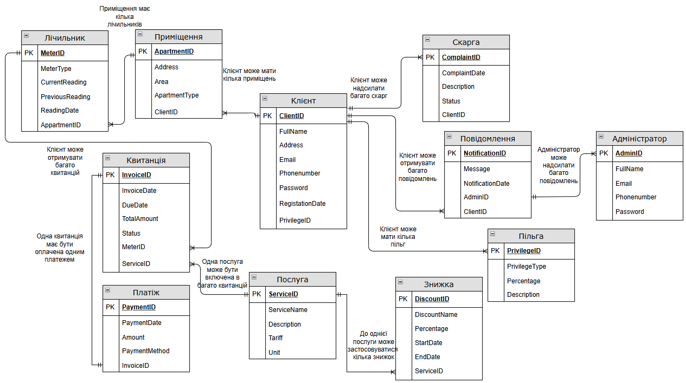

# 🏠 Communal Services Payment System — Database Coursework


A MySQL relational database for a personal account system that tracks communal services (water, electricity, gas, sewage), client apartments, meter readings, invoices, payments, complaints, and notifications.

---

## 📋 Table of Contents

- [Project Overview](#project-overview)
- [Database Schema](#database-schema)
- [Entities](#entities)
- [Repository Structure](#repository-structure)
- [Getting Started](#getting-started)
- [User Roles](#user-roles)
- [Views](#views)
- [Triggers](#triggers)
- [Stored Procedures & Functions](#stored-procedures--functions)
- [Sample Queries](#sample-queries)
- [Business Rules](#business-rules)
- [Query Optimization](#query-optimization)
- [Documentation](#documentation)

---

## Project Overview

The system models an intermediary organization that manages communal services on behalf of multiple providers (electricity, water supply, sewage, etc.) for a residential area. It automates client accounting, invoice generation, payment tracking, discount/privilege application, and complaint handling.

**Tech stack:** MySQL · DataGrip

**Core entities:** Client · Administrator · Privilege · Complaint · Notification · Apartment · Meter · Invoice · Payment · Service · Discount

---

## Database Schema



### Tables

| Table | Description |
|-------|-------------|
| `Client` | Registered clients with personal data and an optional privilege |
| `Administrator` | Staff who maintain the database and handle force-majeure client interactions |
| `Privilege` | Standing discount categories (pensioners, veterans, etc.) tied to a service |
| `Complaint` | Client complaints with status tracking |
| `Notification` | Messages sent from administrators to clients |
| `Apartment` | Apartments linked to clients (address, area, type) |
| `Meter` | Utility meters per apartment (type, current/previous readings) |
| `Invoice` | Bills generated per meter and service |
| `Payment` | Payments made against invoices |
| `Service` | Communal services with tariffs (electricity, water, sewage, etc.) |
| `Discount` | Time-bound promotional discounts tied to a service |

---

## Entities

Every entity has its own `ID` as a unique primary key; this is omitted below since it applies to all of them.

- **Client** — the central entity of the database; many other entities reference it directly or indirectly. Attributes: full name, residential address, phone number, email, account password, registration date, and privilege.
- **Administrator** — manages the database and handles client interactions in exceptional cases. Attributes: full name, email, phone number, password.
- **Privilege** — implements standing discounts for certain categories of the population (e.g., pensioners, veterans). Attributes: privilege type, percentage, and the service it applies to.
- **Complaint** — represents a client's complaint. Attributes: complaint date, description, status, and the ID of the client who filed it.
- **Notification** — a message sent by an administrator. Attributes: message text, send date, the ID of the recipient client, and the ID of the sending administrator.
- **Apartment** — a residential unit. Attributes: address, area, apartment type, and the owning client's ID.
- **Meter** — a utility meter. Attributes: meter type, current reading, previous reading, reading date, and the apartment it's installed in.
- **Invoice** — the amount due for a service and related metadata. Attributes: invoice date, payment deadline, amount due, payment status, meter ID, and service ID.
- **Payment** — a successful invoice payment. Attributes: payment date, amount paid, payment method, and invoice ID.
- **Service** — a communal service offered. Attributes: service name, description, tariff, unit of measurement.
- **Discount** — a promotional offer on a service. Attributes: discount name, percentage, start date, end date, and the service it applies to.

---

## Repository Structure

```
communal-services-db/
│
├── README.md
│
├── schema/
│   └── create_tables.sql           # Table definitions with constraints
│
├── roles/
│   ├── client_role.sql             # Client user — read-only + complaints
│   ├── meter_reader_role.sql       # Meter reader — manage meter readings
│   ├── technical_support_role.sql  # Support — complaints & notifications
│   └── admin_role.sql              # Admin — full access
│
├── data/
│   └── csv files                   # Data in csv tables
│
├── docs/
│   └── documentation               # Documentation
│
├── procedures/
│   └── stored_procedures.sql       # 11 stored procedures and functions
│
├── triggers/
│   └── triggers.sql                # 9 business rule triggers
│
├── views/
│   └── views.sql                   # 4 named views
│
├── queries/
│   └── queries.sql                 # 21 analytical SQL queries
│
└── indexes/
    └── indexes.sql                 # Performance optimization indexes
```

---

## Getting Started

### Prerequisites

- MySQL 8.0+
- MySQL Workbench or DataGrip (optional)

### Setup

```bash
# 1. Create the database
mysql -u root -p -e "CREATE DATABASE communalservices;"

# 2. Create all tables
mysql -u root -p communalservices < schema/create_tables.sql

# 3. Import sample data via DataGrip UI methods

# 4. Set up roles and users (pick the role you need)
mysql -u root -p < roles/admin_role.sql
mysql -u root -p < roles/client_role.sql
mysql -u root -p < roles/meter_reader_role.sql
mysql -u root -p < roles/technical_support_role.sql

# 5. Create procedures, triggers, and views
mysql -u root -p communalservices < procedures/stored_procedures.sql
mysql -u root -p communalservices < triggers/triggers.sql
mysql -u root -p communalservices < views/views.sql

# 6. (Optional) Apply indexes for optimization
mysql -u root -p communalservices < indexes/indexes.sql
```

---

## User Roles

The system defines four roles with different access levels:

### 1. Client (`client_role`)
```sql
CREATE ROLE 'client_role';
GRANT SELECT ON communalservices.Client TO 'client_role';
GRANT SELECT ON communalservices.Apartment TO 'client_role';
GRANT SELECT ON communalservices.Invoice TO 'client_role';
GRANT SELECT ON communalservices.Payment TO 'client_role';
GRANT SELECT, INSERT ON communalservices.Complaint TO 'client_role';
GRANT SELECT ON communalservices.Notification TO 'client_role';
```
Can view their own data and submit complaints.

### 2. Meter Reader (`meter_reader_role`)
```sql
CREATE ROLE 'meter_reader_role';
GRANT SELECT, INSERT, UPDATE ON communalservices.Meter TO 'meter_reader_role';
GRANT SELECT ON communalservices.Apartment TO 'meter_reader_role';
GRANT SELECT ON communalservices.Client TO 'meter_reader_role';
```
Can read client/apartment info and manage meter readings.

### 3. Technical Support (`technical_support_role`)
```sql
CREATE ROLE 'technical_support_role';
GRANT SELECT ON communalservices.Complaint TO 'technical_support_role';
GRANT SELECT, INSERT ON communalservices.Notification TO 'technical_support_role';
GRANT SELECT ON communalservices.Client TO 'technical_support_role';
GRANT SELECT ON communalservices.Apartment TO 'technical_support_role';
```
Can view complaints and send notifications to clients.

### 4. Database Admin (`database_admin`)
```sql
CREATE ROLE database_admin;
GRANT ALL PRIVILEGES ON communalservices.* TO database_admin;
```
Full access to all tables and operations.

---

## Views

The `views/` folder defines 4 named representations used throughout the application:

| View | Description |
|------|-------------|
| `ActiveClients` | Clients along with their privilege type and privilege percentage |
| `UnpaidInvoices` | Invoices that are unpaid but not yet overdue, with client name and apartment address |
| `ClientInvoices` | All client invoices together with client name and apartment address |
| `DetailedClientOverview` | A full picture per client: apartments, meters, invoices, privileges, and any discount applicable to each invoice |

---

## Triggers

The `triggers/` folder contains 9 triggers that enforce business rules and automate side effects:

| Trigger | Event | Purpose |
|---------|-------|---------|
| `MarkComplaintInProcess` | AFTER INSERT ON `Notification` | Moves a client's complaint from 'Unread' to 'In process' once an admin messages them |
| `BeforeMeterInsert` | BEFORE INSERT ON `Meter` | Rejects a new reading lower than the previous one |
| `BeforeMeterUpdate` | BEFORE UPDATE ON `Meter` | Rejects an updated reading lower than the previous one |
| `UpdatePreviousMeterReading` | BEFORE UPDATE ON `Meter` | Shifts the old current reading into `PreviousReading` |
| `ValidateDiscountDates` | BEFORE INSERT ON `Discount` | Rejects a discount whose end date isn't later than its start date |
| `NotifyOverdueInvoice` | AFTER UPDATE ON `Invoice` | Sends a client notification when an invoice becomes overdue |
| `ApplyDiscountToInvoice` | BEFORE INSERT ON `Invoice` | Applies the currently active discount for the invoice's service |
| `ValidateApartmentArea` | BEFORE INSERT ON `Apartment` | Rejects an apartment area of 0 or less |
| `ValidateRegistrationDate` | BEFORE INSERT ON `Client` | Rejects a registration date set in the future |

---

## Stored Procedures & Functions

The `procedures/` folder contains 11 routines:

| Name | Type | Purpose |
|------|------|---------|
| `GetClientDebt` | Function | Total amount across a client's overdue invoices |
| `ChangeComplaintStatus` | Function | Updates a complaint's status and returns a confirmation message |
| `GetActiveDiscount` | Function | Active discount percentage for a given service, if any |
| `SendNotification` | Procedure | Inserts a notification from an admin to a client |
| `ProcessPayment` | Procedure | Records a payment and marks the related invoice as 'Paid' |
| `CalculateCashbackForClient` | Procedure | Cashback for a client based on their privilege and total payments this year |
| `ApplyDiscountToInvoice` | Procedure | Applies discount #4 to an invoice if its service matches |
| `UpdateInvoiceStatusForOverdue` | Procedure | Marks all unpaid, past-due invoices as 'Overdue' |
| `GetMonthlyPaymentReport` | Procedure | Per-client payment totals and counts for a given month |
| `GetTotalPaymentsForClient` | Function | All-time total amount paid by a client |
| `GetAveragePaymentForClientsInCurrentYear` | Function | Average payment amount across all clients this year |

---

## Sample Queries

The `queries/` folder contains 21 analytical queries. A few highlights:

**Clients and their current debt**
```sql
SELECT c.ClientID, c.FullName, c.Email, GetClientDebt(c.ClientID) AS CurrentDebt
FROM Client c;
```

**Streets with the highest total overdue debt**
```sql
SELECT
    SUBSTRING_INDEX(a.Address, ',', 1) AS Street,
    COUNT(DISTINCT c.ClientID) AS DebtorCount,
    SUM(i.TotalAmount) AS TotalDebt,
    AVG(i.TotalAmount) AS AvgDebtPerResident
FROM Apartment a
JOIN Client c ON a.ClientID = c.ClientID
JOIN Meter m ON a.ApartmentID = m.ApartmentID
JOIN Invoice i ON m.MeterID = i.MeterID
WHERE i.Status = 'Overdue'
GROUP BY Street
ORDER BY TotalDebt DESC;
```

**Clients with the highest total payments across all services**
```sql
SELECT c.ClientID, c.FullName, SUM(p.Amount) AS TotalPayments
FROM Client c
JOIN Apartment a ON c.ClientID = a.ClientID
JOIN Meter m ON a.ApartmentID = m.ApartmentID
JOIN Invoice i ON m.MeterID = i.MeterID
JOIN Payment p ON i.InvoiceID = p.InvoiceID
GROUP BY c.ClientID, c.FullName
ORDER BY TotalPayments DESC;
```

---

## Business Rules

Implemented via table constraints, triggers, and stored procedures:

- A meter's current reading can never be lower than its previous reading (`BeforeMeterInsert`, `BeforeMeterUpdate`)
- An apartment's area must be greater than 0 (`ValidateApartmentArea`)
- A client's registration date cannot be in the future (`ValidateRegistrationDate`)
- A discount's end date must be later than its start date (`ValidateDiscountDates`)
- Unpaid invoices past their due date are automatically marked 'Overdue' (`UpdateInvoiceStatusForOverdue`)
- A notification is generated automatically when an invoice becomes overdue (`NotifyOverdueInvoice`)
- A complaint moves from 'Unread' to 'In process' as soon as an admin responds (`MarkComplaintInProcess`)
- The currently active discount is applied automatically to new invoices (`ApplyDiscountToInvoice`)
- Clients with a privilege receive cashback based on their privilege percentage and yearly payments (`CalculateCashbackForClient`)
- Sewage disposal cost is calculated based on water supply consumption

---

## Query Optimization

An index on `Service.ServiceName` was added to optimize service-name filtering queries:

```sql
CREATE INDEX idx_service_name ON Service(ServiceName);
```

**Result:** The EXPLAIN output for query #12 showed rows examined dropped from **4 → 1** after index creation. Primary key and foreign key indexes were auto-generated by DataGrip on table creation.
---

## Documentation

Documentation and presentation are in `docs/`.
